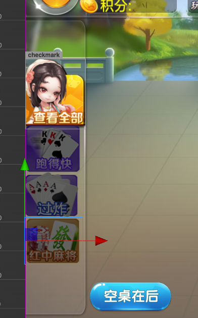
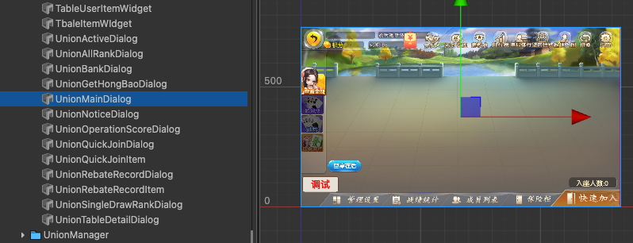
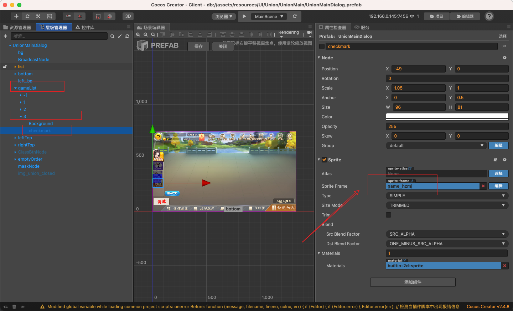

# 棋牌游戏框架资源

### 1. 项目介绍

> 本项目乃阉割版, 部分游戏玩法未公开,详情请看 [.gitignore](/.gitignore)
>
> 1. 杜绝伸手党（有开发能力可发出 issues 申请成为开发者，需缴纳低额保证金，直到有一定代码贡献的时候退还保证金，代码贡献不包括 游戏玩法，更多的是对游戏的完善）
> 2. 避免法律风险

## 创建并初始化

版本信息：

```
android sdk: 30
ndk: 21
cocos: 2.4.8
node: 8.15.1
	pomelo@2.2.7
```

```bash
docker-compose up
```

### 创建数据库

```bash
mongo --port 27017 -u "mongoUser" -p "mongoPass" --authenticationDatabase "admin"
use game
db.createCollection("admins")
db.admins.insert({uid: 1, account: "admin", password: "Admin123456", nickname:"超级管理员",permission:-1, createTime: 0});
ctrl + c
```

#### 重启项目

```bash
docker-compose restart
```

### 配置

>  关于服务器IP，请仔细阅读 docker-compose.yaml / docker-compose-dev.yaml

#### 服务端配置：

```json
// Server/config/servers.json
{
  "development":{
    "connector": [
      {"id": "connector-1", "host": "127.0.0.1", "port": 11000, "clientHost": "example.com", "clientPort": 12000, "frontend": true, "args": " --inspect=5850"}
    ],
    ...
  }
}
```

- clientHost: 如果使用 CDN 需要设置端口为 80

```json
// Server/config/redis.json
{
  "redis": {
    "host": "172.18.188.14",
    "port": 6379,
    "password":"123456"
  }
}
```

- password: docker-compose 上设置的密码

```json
{
  "mongo": {
    "host": "172.18.188.13",
    "port": 27017,
    "database": "game",
    "user": "game",
    "password": "123456"
  }
}
```

#### 管理页面设置

```json
// WebServer/config/gameServer.json
{
  "gameHttpAddress": "https://example.com"
}
```

```json
// WebServer/config/mongo.json
{
  "mongo": {
    "host": "172.18.188.13",
    "port": 27017,
    "database": "game",
    "user": "game",
    "password": "123456"
  },
  "statsMongo": {
    "host": "172.18.188.13",
    "port": 27017,
    "database": "game"
  },
  "AutoIncrementStartAt":100000
}
```

```json
// WebServer/config/redis.json
{
  "redis": {
    "host": "172.18.188.14",
    "port": 6379,
    "password":"123456"
  }
}
```

```json
// WebServer/public/hot-update/updateControl.json
{
  "hotUpdate": true,
  "bigUpdateDownloadUrl": "https://example.com/game-download"
}
```

#### 客户端配置

```js
// Client/assets/Script/Constant/Constant.js
let DEBUG = false;
// 网页发布版本
let WEB_PRODUCTION = false;
let SERVER_IP      = "https://examle.com:13000";
let SERVER_IP_WEB  = "https://example.com:14000";
```

### 热更新

- 推荐阅读：https://www.jianshu.com/p/e8f6b85c530d
- 资源服务器URL：https://example.com:14000/hot-update/
- 生成热更包后解压并复制到 WebServer/public/hot-update/ 目录内，避免冲突，可以先删除相同的文件/夹 后 再复制

## Bug

### 联盟内列表不发光



先找到 文件 UnionMainDialog





看一下资源有没有绑定上去

## 服务器资源

由于我是部署在 Cloudflare 上的，所以 开发 和 正式 服务器用的是不同的域名，方便切换

```bash
# 生产环境
server_13000: example.com
server_80: example.com
web_manage_14000: example.com
mongodb: example.com

# 开发环境
server_13000: debug.example.com
server_80: debug.example.com
web_manage_14000: debug.example.com debug.example.com/gm-tools admin:Admin123456

# 更多文档请查看 development 和 development/server_status 下的 README.md
dev_web_manage_18080: debug.example.com admin:Admin123456
dedv_code_8080: debug.example.com admin:Admin123456
```

## 开发注意事项

1. 中文符号转英文
   - [vscode 中文标点符号转英文](https://marketplace.visualstudio.com/items?itemName=grasspy.autopunc)
   - [webstorm CharAutoReplace](https://plugins.jetbrains.com/plugin/17345-charautoreplace)
2. 自动去除多余空格
   - [VS Code保存文件时自动删除行尾空格](https://blog.csdn.net/cc18868876837/article/details/107099521)
   - [IntelliJ IDEA自动去掉行尾空格](https://www.cnblogs.com/jeffen/p/6014868.html)
3. README 文档及时更新
4. TODO 标签标注
5. 书签记忆
   - [【vscode】Bookmarks使用](https://blog.csdn.net/HEJI1103/article/details/89034509)
   - webstorm 只需要在代码左侧右键添加书签即可,也可左边栏 修改名称
6. .vscode .idea 需要同步 方便分享做的笔记书签
